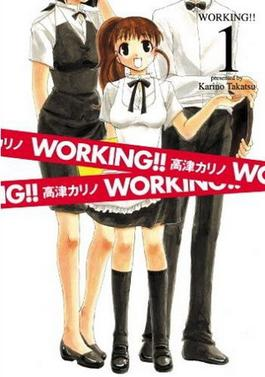

# Working!!

《**迷糊餐廳**》（日版名：WORKING!!，英文版名：WAGNARIA!!，中国大陆译作“**迷糊餐厅**”，香港译作“**WORKING!!無聊西餐廳**”，台湾译作“**WORKING!!迷糊餐廳**”）是日本女性漫畫家[高津Karino](https://zh.wikipedia.org/wiki/%E9%AB%98%E6%B4%A5Karino)筆下一部已完结的[四格漫畫](https://zh.wikipedia.org/wiki/%E5%9B%9B%E6%A0%BC%E6%BC%AB%E7%95%AB)作品，並與作者另一同名作品採用[共同世界觀](https://zh.wikipedia.org/wiki/%E5%85%B1%E5%90%8C%E4%B8%96%E7%95%8C)。本作品曾三度改編成[電視動畫](https://zh.wikipedia.org/wiki/%E9%9B%BB%E8%A6%96%E5%8B%95%E7%95%AB)。 